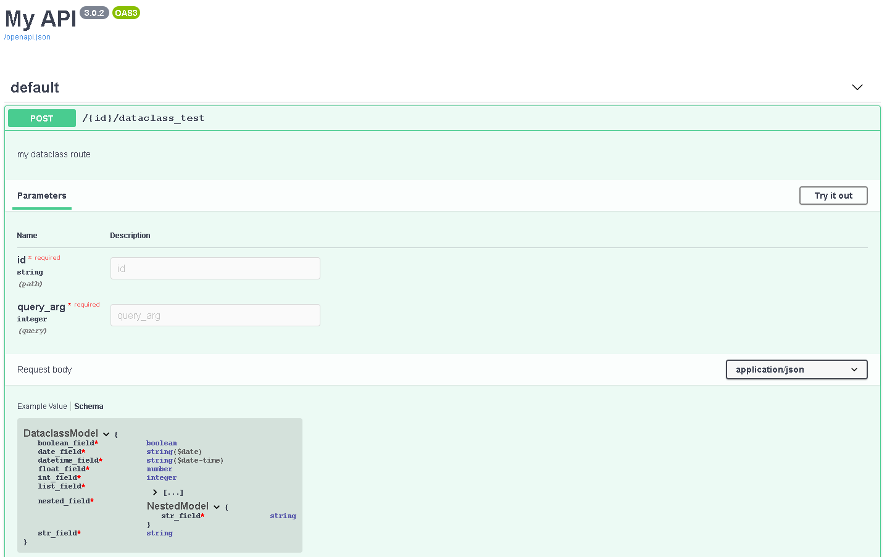

## not mainained anymore

This was a fun experiment, but I no longer use this code. I'd recommend using FastAPI instead.


[](https://travis-ci.org/GabrielCappelli/flask-hintful)
[](https://codecov.io/gh/GabrielCappelli/flask-hintful)
[](https://flask-hintful.readthedocs.io/en/latest/?badge=latest)
# Flask-Hintful
Flask-Hintful helps you write Restful APIs using Flask by taking advantage of Python's type hints.

Includes support for serializing/deserializing parameters according to type hints and automatically generating OpenApi documentation for your registered routes.

## Requirements

* Python 3.7+
* Flask
* Marshmallow < 3

## Installation

Install using pip

```pip install flask-hintful```

## Quick Start

Construct a FlaskHintful object by passing the Flask application as a parameter, then use the FlaskHintful object `@route` and `.register_blueprint` to register routes.

Create your view functions with type hints and FlaskHintful will serialize pass path args, query args and even the request body for you.

```python
from dataclasses import dataclass
from datetime import date, datetime

from flask import Flask

from flask_hintful import FlaskHintful

app = Flask('My API')
api = FlaskHintful(app)


@dataclass
class NestedModel():
    str_field: str


@dataclass
class DataclassModel():
    str_field: str
    int_field: int
    float_field: float
    boolean_field: bool
    list_field: list
    date_field: date
    datetime_field: datetime
    nested_field: NestedModel


@api.route('/<id>/dataclass_test', methods=['POST'])
def dataclass_route(id: str, query_arg: int, model: DataclassModel) -> DataclassModel:
    '''my dataclass route'''
    return model


app.run()
```

You will be able to access the generated OpenApi on `/swagger`.



## Documentation

https://flask-hintful.readthedocs.io/

## License

This project is licensed under the MIT License - see the [LICENSE](LICENSE) file for details
